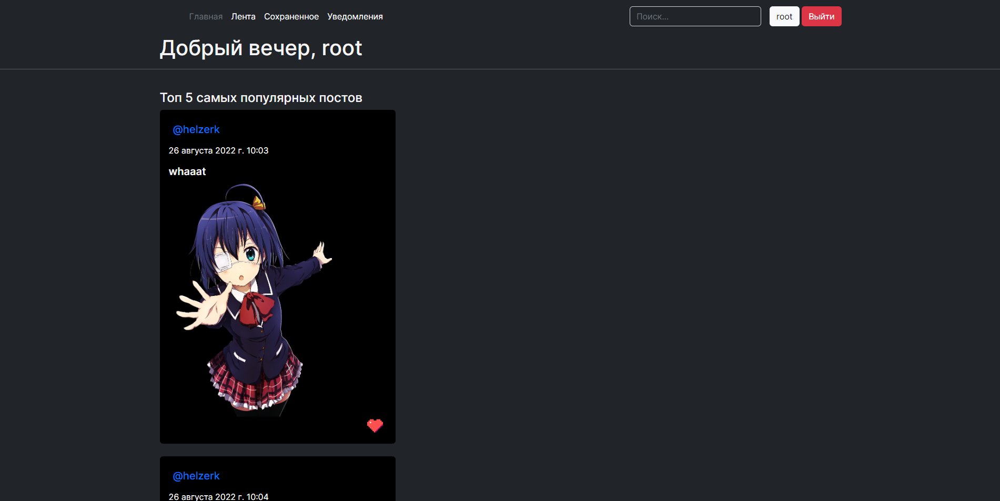

# Mood

mood - социальная сеть на Django

Из реализованного функционала :
  - профиль
  - изменения профиля
  - интересы
  - посты
  - уведомления
  - лента
  - сохранненые посты
  - лайки
  - подписки
  и т.д

# Requirements

  - **django**
  - **pillow**
  
# Структура проекта:

  - **core** - кор функционал(профиля, регистрация/авторизация, лента и т.д)
  - **posts** - модуль инкапсулирует в себе логику работы с постами(представления, круды и т.д.)
  - **notifications** - модуль инкапсулирует в себе логику работы с уведомлениями

# Потыкать можно здесь - http://moodnetwork.pythonanywhere.com/

